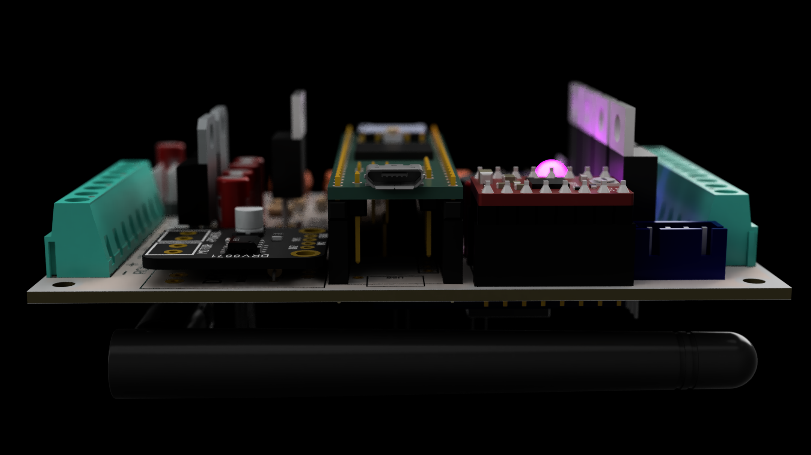

In this repo you'll find the PCB design and manufacturing files, as well as the code. For now it can reliably trigger first and second events. I'm working actively on this project to add reliable data logging and telemetry (and many other things...).

